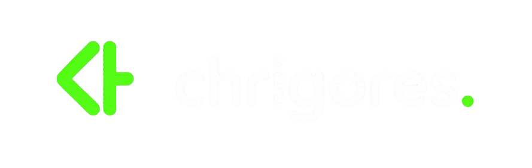

<a href="https://www.chrigores.com/">
  <picture>
    <source media="(prefers-color-scheme: dark)" srcset="./assets/chr-black.png">
    <source media="(prefers-color-scheme: light)" srcset="./assets/chr-white.png">
    
  </picture>
</a>

 

<strong>MATHEUS FARIA</strong>

  

TypeScript Developer · CEO at Chrigores

  

Tecnologia com propósito. Pessoas no centro.

  

&nbsp;&nbsp;

&nbsp;&nbsp;

&nbsp;&nbsp;

&nbsp;&nbsp;

 

<strong>CHRIGORES</strong>

  

A <a href="https://www.chrigores.com/"><strong>Chrigores</strong></a> é a união de três desenvolvedores que transformam ideias e problemas reais em soluções digitais eficientes.

Criamos aplicações que organizam processos, reduzem tarefas repetitivas e devolvem tempo para pessoas e negócios.

 

 

<strong>TECNOLOGIAS</strong>

  

<table>
  <tr>
    <td align="center" width="105">
      
       
      <b>Next.js</b>
    </td>
    <td align="center" width="105">
      
       
      <b>TypeScript</b>
    </td>
    <td align="center" width="105">
      
       
      <b>NestJS</b>
    </td>
    <td align="center" width="105">
      
       
      <b>Python</b>
    </td>
    <td align="center" width="105">
      
       
      <b>Supabase</b>
    </td>
  </tr>
</table>

Disponíveis para novos projetos, parcerias e desafios.

  

<a href="https://www.chrigores.com/"><strong>Conheça a Chrigores →</strong></a>

